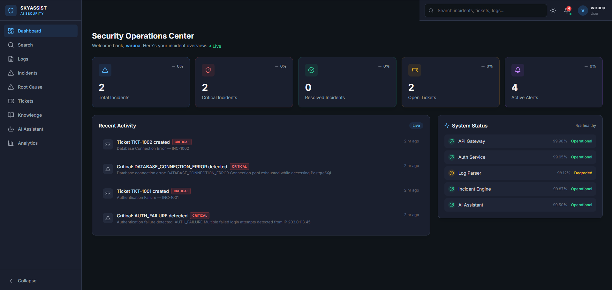
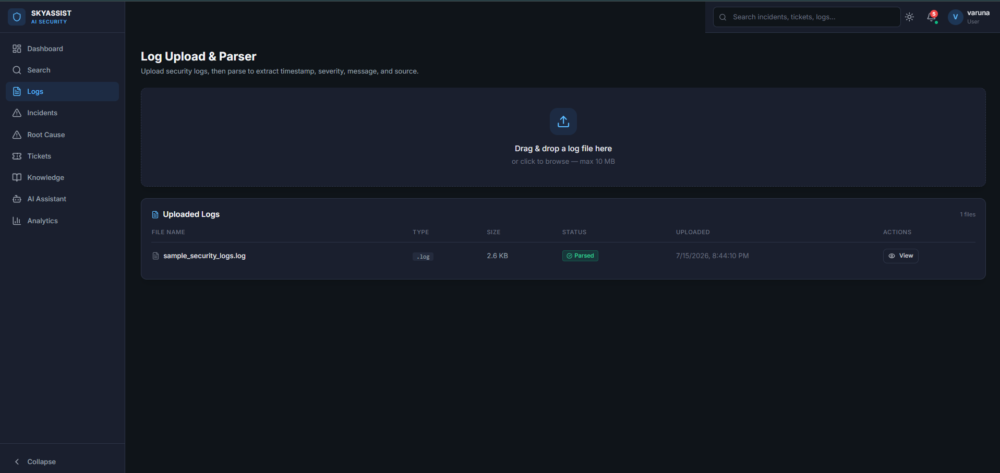
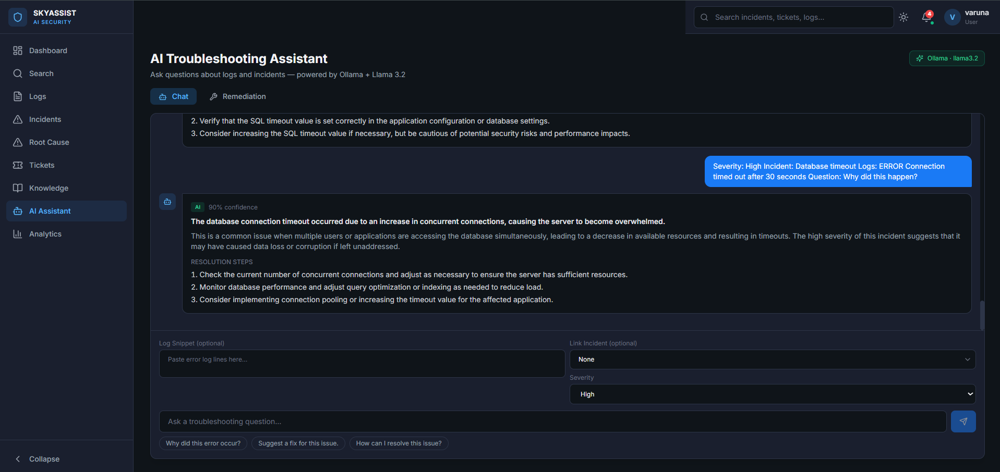
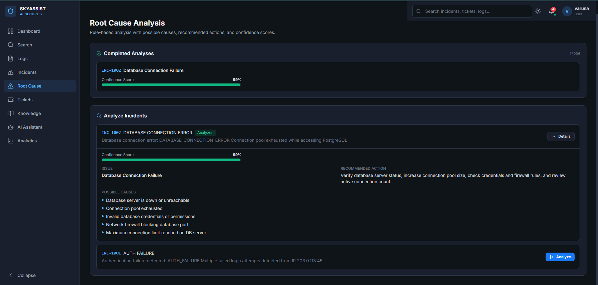
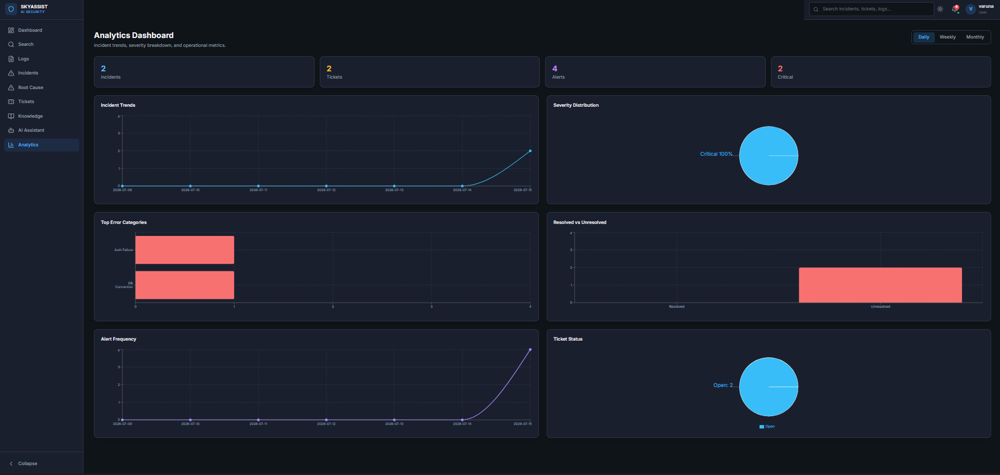

# 🛡️ SkyAssist AI
### AI-Powered Security Troubleshooting & Incident Analysis Platform

SkyAssist AI is a full-stack Security Operations Center (SOC) platform that helps security teams upload and analyze logs, detect incidents, perform root cause analysis, generate AI-assisted troubleshooting recommendations, and monitor security operations through a modern real-time dashboard.

The platform integrates **FastAPI**, **React**, **PostgreSQL**, **Docker**, **WebSockets**, and **Ollama (Llama 3.2)** to provide local AI-powered incident investigation while keeping data on-premise.

---

# 🚀 Features

### 📊 Security Operations Dashboard
- Live security overview
- Incident statistics
- Ticket statistics
- Alert monitoring
- System health status
- Real-time activity feed

---

### 📄 Log Upload & Parsing
- Upload security log files
- Automatic log parsing
- Extract timestamps
- Extract severity levels
- Identify error messages
- Store parsed logs in PostgreSQL

---

### 🚨 Incident Management
- Automatic incident generation
- Severity classification
- Incident lifecycle tracking
- Incident history
- Incident search

---

### 🧠 Root Cause Analysis
- Analyze detected incidents
- Display confidence score
- Identify possible causes
- Recommend corrective actions
- View completed analyses

---

### 🤖 AI Troubleshooting Assistant
Powered by **Ollama + Llama 3.2**

Supports:
- Log-based troubleshooting
- Security incident explanation
- Root cause identification
- Resolution suggestions
- AI remediation recommendations

Runs completely locally without requiring cloud AI APIs.

---

### 🎫 Ticket Management
- Create investigation tickets
- Track ticket status
- Link tickets with incidents
- View open tickets

---

### 📈 Analytics Dashboard
Visual operational insights including:
- Incident trends
- Alert frequency
- Severity distribution
- Ticket status
- Top error categories

---

### 🔐 Authentication & Security
- JWT Authentication
- Role-based authorization
- Password hashing
- Protected REST APIs
- CORS configuration

---

### ⚡ Real-Time Updates
- WebSocket notifications
- Live dashboard updates
- Automatic alert refresh

---

# 🏗️ System Architecture

```
                React Frontend
                       │
                       ▼
               FastAPI REST APIs
                       │
      ┌────────────────┼────────────────┐
      ▼                ▼                ▼
 PostgreSQL      Ollama (Llama 3.2)   WebSockets
      │                │                │
      └────────── Incident Engine ──────┘
```

---

# ⚙️ Tech Stack

## Frontend

- React
- TypeScript
- Tailwind CSS
- Vite
- Recharts
- React Router
- Axios

---

## Backend

- Python
- FastAPI
- SQLAlchemy
- Pydantic
- JWT Authentication
- Alembic
- WebSockets

---

## Database

- PostgreSQL

---

## AI

- Ollama
- Llama 3.2

---

## DevOps

- Docker
- Docker Compose
- Nginx

---

# 📸 Application Screenshots

## Dashboard



---

## Log Upload & Parser



---

## AI Troubleshooting Assistant



---

## Root Cause Analysis



---

## Analytics Dashboard



---

# 📂 Project Structure

```
SkyAssist-AI/

├── backend/
│   ├── api/
│   ├── routes/
│   ├── models/
│   ├── schemas/
│   ├── services/
│   ├── websocket/
│   ├── ai_engine/
│   ├── incident_engine/
│   ├── ticket_engine/
│   └── alembic/
│
├── frontend/
│   ├── src/
│   ├── components/
│   ├── pages/
│   ├── services/
│   └── types/
│
├── docker/
├── docs/
├── screenshots/
└── docker-compose.yml
```

---

# 🚀 Running Locally

## Clone

```bash
git clone https://github.com/Varunpv2005/SkyAssist-AI.git

cd SkyAssist-AI
```

---

## Docker

```bash
docker compose --profile ai up -d --build
```

---

## Application URLs

| Service | URL |
|----------|-----|
| Frontend | http://localhost |
| Backend API | http://localhost:8000 |
| Swagger Docs | http://localhost:8000/docs |
| Health Check | http://localhost:8000/health |

---

# 🔮 Future Improvements

- Redis Pub/Sub for scalable WebSockets
- Email & Slack alert notifications
- Elasticsearch integration
- Advanced log correlation
- Threat intelligence integration
- Kubernetes deployment
- Multi-user organization support

---

# 👨‍💻 Author

**Varun Venugopal**

GitHub:
https://github.com/Varunpv2005

LinkedIn:
(Add your LinkedIn URL)

---

# ⭐ If you found this project interesting, consider giving it a star!
